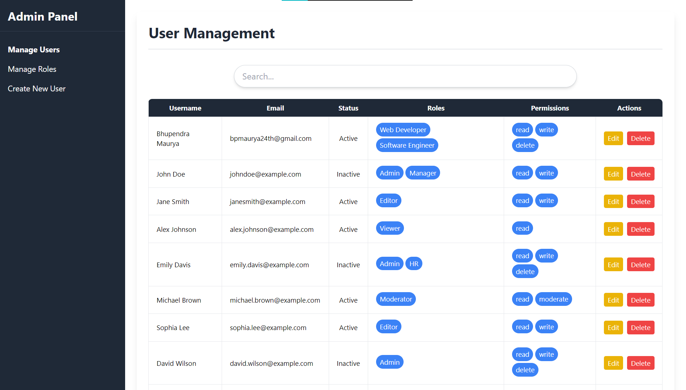
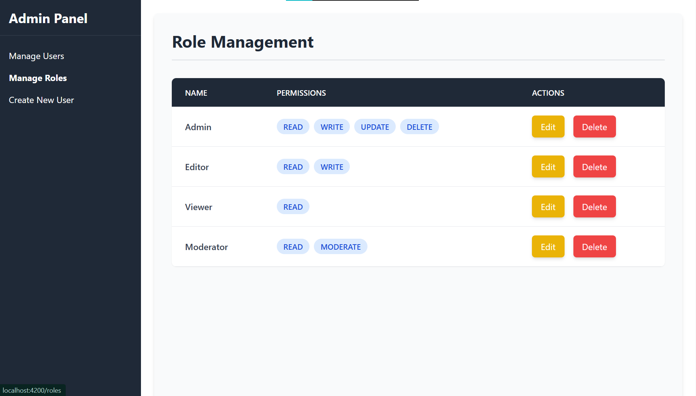
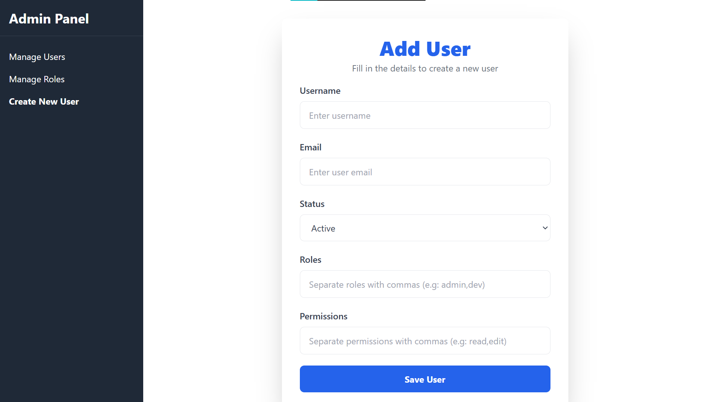

# Admin Dashboard


This project is an Admin Dashboard application built using **Angular**. It allows administrators to manage users and roles, view data, and perform CRUD operations for both users and roles with associated permissions.

This project was generated using [Angular CLI](https://github.com/angular/angular-cli) version 19.0.2.

## Installation

To get started with the project locally, follow the steps below.

### Prerequisites

Ensure you have the following installed:

- [Node.js](https://nodejs.org/) (version 14 or above)
- [Angular CLI](https://angular.io/cli)

### Steps to Install:

1. Clone this repository:
    ```bash
    git clone https://github.com/Bhupendra-Maurya/admin-dashboard.git
    cd admin-dashboard
    ```

2. Install dependencies:
    ```bash
    npm install
    ```
3. Move to admin-dashboard:
    ```bash
    cd admin-dashboard
    ```
## Development server

To start a local development server, run:

```bash
ng serve
```

Once the server is running, open your browser and navigate to `http://localhost:4200/`. The application will automatically reload whenever you modify any of the source files.

## JSON Server

To start json server, run:

```bash
json-server --watch db.json
```

Once the server is running, open your browser and navigate to 
**Endpoints:**
`http://localhost:3000/users`,
`http://localhost:3000/roles`.
where you can see the data of your server.

Example:
```json
[
    {
        "id": "e6fa",
        "username": "Bhupendra Maurya",
        "email": "bpmaurya24th@gmail.com",
        "status": "active",
        "roles": [
            "Web Developer",
            "Software Engineer"
        ],
        "permissions": [
            "read",
            "write",
            "delete"
        ]
    }
]
```

## Code scaffolding

Angular CLI includes powerful code scaffolding tools. To generate a new component, run:

```bash
ng generate component component-name
```

For a complete list of available schematics (such as `components`, `directives`, or `pipes`), run:

```bash
ng generate --help
```

## Building

To build the project run:

```bash
ng build
```

This will compile your project and store the build artifacts in the `dist/` directory. By default, the production build optimizes your application for performance and speed.

## Running unit tests

To execute unit tests with the [Karma](https://karma-runner.github.io) test runner, use the following command:

```bash
ng test
```

## Running end-to-end tests

For end-to-end (e2e) testing, run:

```bash
ng e2e
```

Angular CLI does not come with an end-to-end testing framework by default. You can choose one that suits your needs.

---

# Project Structure

The project follows a structured directory layout, organized into various components, services, models, and configurations. Here’s an overview of the project structure:

```
admin-dashboard/
├── src/
│   ├── app/
│   │   ├── components/
│   │   │   ├── dashboard/
│   │   │   ├── user-list/
│   │   │   ├── user-popup-modal/
│   │   │   ├── role-list/
│   │   │   ├── role-popup-modal/
│   │   │   ├── search-bar/
│   │   │   ├── user-form/
│   │   │   └── pagenotfound/
│   │   ├── models/
│   │   │   └── user.model.ts
│   │   ├── services/
│   │   │   ├── role.service.ts
│   │   │   └── user.service.ts
│   │   └── app.module.ts
│   ├── db.json
└── angular.json
```

### Description of Directories and Files:

- **src/app/components/**
  - Contains all UI components such as:
    - `dashboard`: Dashboard overview page.
    - `user-list`: Displays list of users.
    - `user-popup-modal`: Modal for managing user details.
    - `role-list`: Displays list of roles.
    - `role-popup-modal`: Modal for managing roles.
    - `search-bar`: Search functionality for filtering users/roles.
    - `user-form`: Form for adding/editing users.
    - `pagenotfound`: 404 page for invalid routes.

- **src/app/models**
  - Contains TypeScript models, such as `user.model.ts`, for defining data structures.

- **src/app/services**
  - Contains services like `role.service.ts` and `user.service.ts` for API calls and business logic.

- **src/db.json**
  - A mock database used to simulate backend operations in this project.

## **Project Overview**

This project is built with Angular and provides an interface for managing users and roles. It allows administrators to:
- View and manage users
- Add, edit, and delete users
- Assign roles to users and manage their status (Active/Inactive)
- Create and edit roles with dynamic permissions
- Assign permissions to roles and edit them as needed

## **Features**

### **User Management**
- **View Users**: List all users and their associated details (name, roles, status).
- **Add User**: Create a new user by filling out a form with the user's name, role, and status.
- **Edit User**: Modify user details such as name, role, and status.
- **Delete User**: Remove a user from the system.
- **Assign Roles**: Select roles for users from a list of available roles.


- **Define Roles**: Create new roles with specified permissions.
- **Edit Roles**: Modify existing roles, including updating the role name, description, and permissions.
- **Delete Roles**: Remove a role from the system.
- **Assign Permissions to Roles**: Customize the permissions (Read, Write, Delete) for each role.

## **Technologies Used**
- **Angular**: Framework used for building the frontend.

- **Angular Forms Module**: Angular’s reactive approach for handling form input and validation.
- **TypeScript**: Programming language used to write the code.
- **HTML**: For structuring the website.
- **Tailwind/CSS**: For styling the application’s interface.


## **How It Works**

1. **Manage Users**: 
   - The user component allows an administrator to manage users in the system. It provides functionalities to view, add, edit, and delete users. 
   - Roles, Permissions, Status can be assigned to users, can be added or modified and their status can be updated between "Active" and "Inactive."

2. **Create New User**:
   - This is a form to create new users.
   - It provides inputs to username, email, status, roles and permissions. 

3. **Manage Roles**:
   - The role management allows editing, and deleting roles.
   - Each role has an associated set of permissions, which can be assigned and modified.

  **NOTE :** 
  - `This page is just to demonstrate what types of permissions can be assign to different roles.`
  - `Changes made here will not be reflected in Manage Users`
  - `You can change anything from Manage users itself.`


## **Services**

- **User Service**: Manages the user-related operations such as fetching, adding, editing, and deleting users.
- **Role Service**: Handles the role-related operations such as fetching, adding, editing, and deleting roles.

## **Validation & Error Handling**

- Both user and role forms are validated for required fields. The form validations ensure that data is entered correctly before submitting.
- Error handling is implemented in form submission processes, ensuring smooth data interaction.


## Additional Resources

For more information on using the Angular CLI, including detailed command references, visit the [Angular CLI Overview and Command Reference](https://angular.dev/tools/cli) page.


### **Contact**
- **Bhupendra Maurya**: [LinkedIn](https://www.linkedin.com/in/bhupendramaurya/)  
- **Email**: [bpmaurya24th@gmail.com](mailto:bpmaurya24th@gmail.com)



